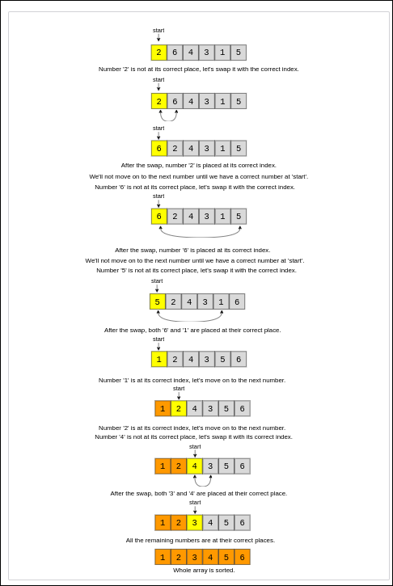

# Cyclic Sort
We are given an array containing n objects. Each object, when created, was assigned a unique number from the range 1 to n based on their creation sequence. This means that the object with sequence number 3 was created just before the object with sequence number 4.

Write a function to sort the objects in-place on their creation sequence number in O(n)
O(n)
 and without using any extra space. For simplicity, let’s assume we are passed an integer array containing only the sequence numbers, though each number is actually an object.

Example 1:
> Input: [3, 1, 5, 4, 2]  
Output: [1, 2, 3, 4, 5]

Example 2:
> Input: [2, 6, 4, 3, 1, 5]  
Output: [1, 2, 3, 4, 5, 6]

Example 3:
> Input: [1, 5, 6, 4, 3, 2]  
Output: [1, 2, 3, 4, 5, 6]

## Solution
As we know, the input array contains numbers from the range 1 to n. We can use this fact to devise an efficient way to sort the numbers. Since all numbers are unique, we can try placing each number at its correct place, i.e., placing 1 at index ‘0’, placing 2 at index ‘1’, and so on.

To place a number (or an object in general) at its correct index, we first need to find that number. If we first find a number and then place it at its correct place, it will take us O(N^2), which is not acceptable.

Instead, what if we iterate the array one number at a time, and if the current number we are iterating is not at the correct index, we swap it with the number at its correct index. This way, we will go through all numbers and place them at their correct indices, hence, sorting the whole array.



## Code (java)
```
public static void sort(int[] nums) {
  int i = 0;
  while (i < nums.length) {
    int j = nums[i] - 1;
    if (nums[i] != nums[j])
      swap(nums, i, j);
    else
      i++;
  }
}
```
